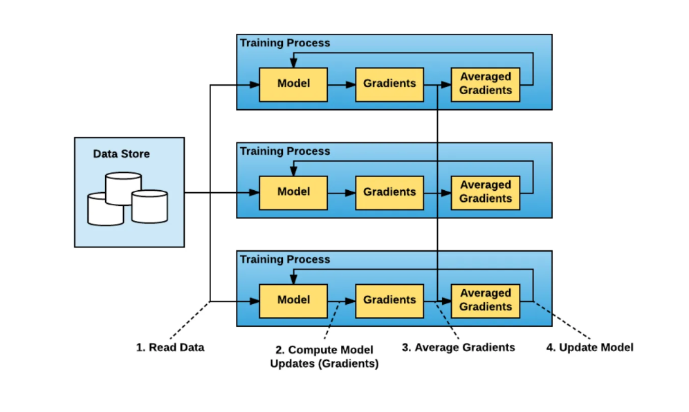
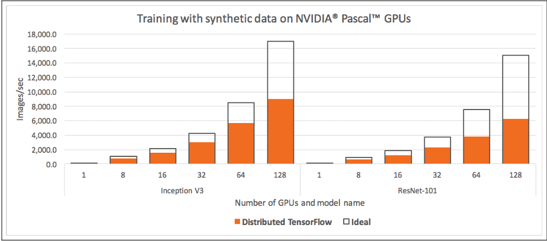
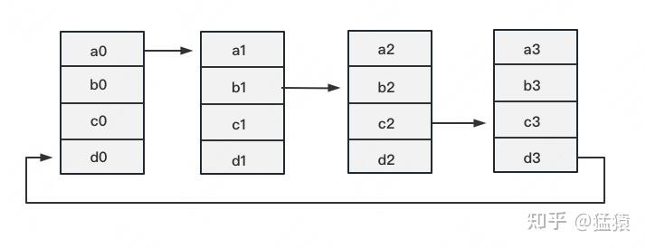
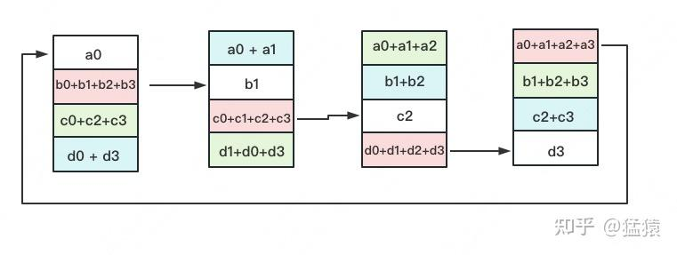
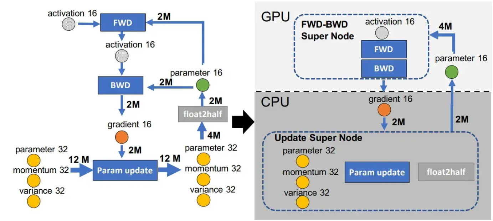
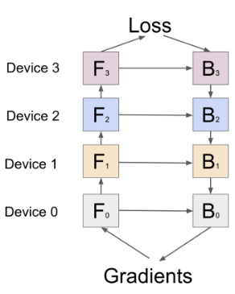
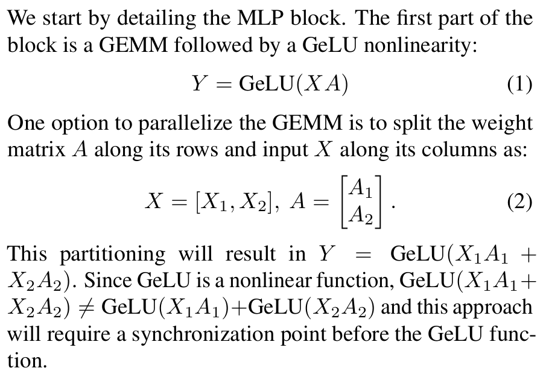
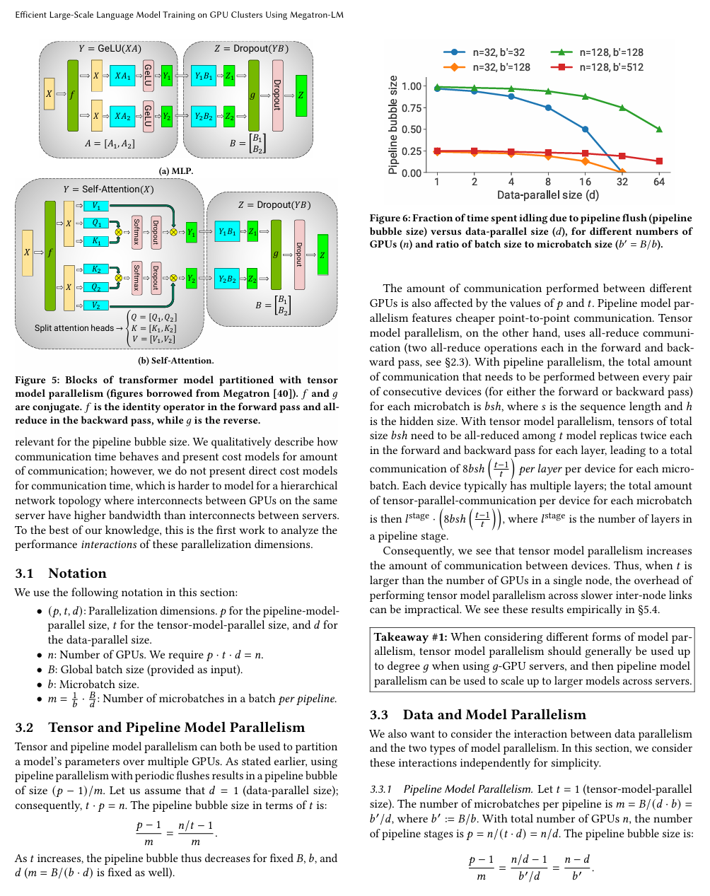
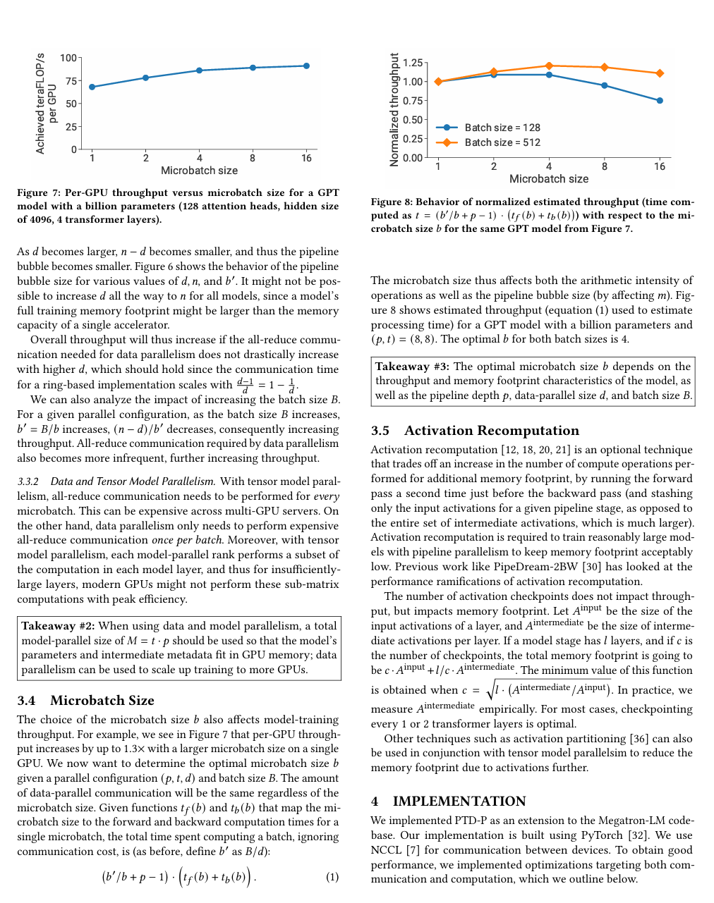
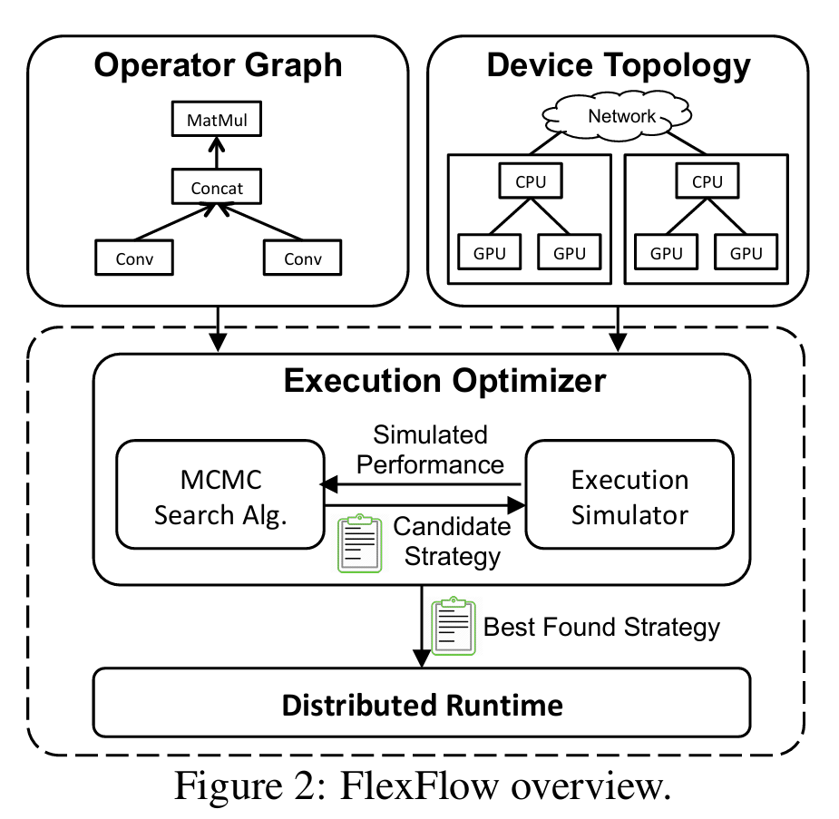

---
# 文章标题
title: AISys_分布式开发
# 设置写作时间
date: 2024-10-28
# 一个页面可以有多个分类
category:
  - SOSD
# 一个页面可以有多个标签
tag:
  - 分布式系统
  - AISys
  - 并行运算
# 此页面会在文章列表置顶
sticky: true
# 此页面会出现在文章收藏中
star: true
# 侧边栏的顺序
# 数字越小越靠前，支持非整数和负数，比如 -10 < -9.5 < 3.2, order 为 -10 的文章会最靠上。
# 个人偏好将非干货或随想短文的 order 设置在 -0.01 到 -0.99，将干货类长文的 order 设置在 -1 到负无穷。每次新增文章都会在上一篇的基础上递减 order 值。
order: -1.2
---

## 为什么AI需要分布式系统

### 什么是分布式系统

分布式系统顾名思义，就是将单一计算机节点要做的任务`分布`在多个计算机节点上完成的，各个节点之间通过网络进行通讯的计算机系统。  

这种系统的好处是显而易见的，我们可以把一台机器的Task进行切分，可能大幅度`提升计算效率`；我们可以把一台机器存不下的任务放到多个结点里面，`拓展数据规模`。  

但同时也可能引入更多的问题，多台机器之间通讯耗费的时间会不会比原先计算的时间更长？切分后的任务如何再将结果重新合在一起？这些都问题都有进一步研究的价值。  

### 为什么AI训练需要分布式系统

在训练AI时，无论在CV方向还是NLP等其他方向，无论使用哪一种模型，总是绕不开`训练集`和`测试集`这两部分，我们总要拿出一部分数据用来预训练模型，另一部分用来测试模型效果。  

`数据集越大，训练效果越好`，这基本上是在不考虑机器性能上限的情况下，我们针对AI训练达成的一种共识，所以在训练AI时我们希望能使用尽可能大的数据集，使用尽可能多的参数，来对尽可能多的标签进行刻画。但可惜一台机器的性能总是有限的。  

这个时候就不得不引入`分布式系统`来改善这种局面了，如果我们一台机器、一张GPU/TPU没办法高效完成我们的运算，那我们可以分到多张卡上面；如果我们一台机器存储不开我们的数据集，那我们可以分到多台设备上，或者考虑让CPU也存储一部分模型数据。这就是AI使用分布式系统想要解决的问题。

## 分布式系统如何发挥作用

### 数据分布式的一些基本想法  

如果我们希望分布式系统在AI训练中发挥他的力量，我们要怎么做呢？大家都对ML有一些基本的认识了，无论哪一种模型，在训练过程中总会有数据（输入、输出），模型（参数、激活函数）等等需要保存的东西。  

现在假定我们要做一个训练任务，我们有我们自己的很大的`数据集`，我希望能把这个数据`很快的训练完`，那我们就可以考虑把数据`切分`成好几份，然后给`不同的GPU`去算每一个单独的部分，这种每个一份数据切分成多份，给不同的GPU做计算的方式，但每一个GPU均做`保留完整的模型`做计算，被我们称作`数据并行（Data Patallel，简称DP）`。  

既然可能有很大的`数据集`需要切分，那自然也可能有很大的`模型`进行切分，让每一个GPU仅保留`几个隐藏层的模型`（参数、激活函数），这样可以训练更大的模型，提升训练精度，这种按层切分模型，不切分数据的方式，被称作`模型并行（Model Patallel，简称MP）`。

这种按层切分的方式固然可以增加可容纳的模型的大小，但是仅让一个卡存模型的几层在计算某些必须要用到之前的数据的模型时可能不尽如人意，通讯成本会比较高昂。  

为了解决层切分的弊端，我们可以考虑将计算过程中的算子/计算矩阵进行切分，让每一张卡只保留必须的参数和算子，产生部分输出，这样就可以将每一部分计算矩阵进行并发处理，我们将这种方式称作`张量并行/算子并行（Tensor Patallel，简称TP）`，谷歌专门为TP开发了TPU进行并发适配，TP也是应用较广的基本并发方式。

既然我们有了对数据切分的方法，有了对模型算子切分的方法，那我们也可以考虑进行结合，既切分优化器状态，又切分模型的参数、梯度，这种并行方式被称作`完全分片数据并行（Fully Sharded Data Parallel，简称FSDP）`。  

前面所提及的方法，是在利用切分层内数据/优化器状态/模型绕过MP方法按层切分时可能带来的通讯瓶颈，但是也可以利用类似CPU指令流水线执行的方式，进行数据计算，切分模型让不同GPU延后计算开始时间，从而保证通讯无boundary，这种方式被称作`流水线并行（Pipe Parallel，简称PP）`。  

在探讨了DP、PP、TP基本并行方式后，我们可以考虑将三种并行方式进行综合，考虑一些综合利用并行方式的策略，这种并行考量被称为`3D并行`。  

事实上对于采用哪种并行模式，要用多少张卡进行并行，并行中使用的参数如何调整，是一件非常复杂的事情，我们期望有可以`自动为我们选定并行方法的策略`，这种策略被称作`自动并行`。

## 数据并行（DP）

### 典型数据并行的流程

  

  

- 分配n块计算GPU（图中0-2）;1块梯度收集GPU
- 每块GPU均拷贝一份完整的模型
- 把一份Data（也可以是一个batch）切分成若干份给不同的GPU
- 每一块GPU完成Forward和Backward后，计算出本地的梯度
- 把本地梯度push到梯度收集GPU，梯度收集GPU聚合梯度
- 计算GPU从聚合GPU中pull完整梯度，更新模型参数，保证各个计算GPU模型同步  

> 聚合再下发梯度操作被称为`AllReduce`  

### Horovod

> Horovod: fast and easy distributed deep learning in TensorFlow  

`https://arxiv.org/abs/1802.05799` `https://github.com/uber/horovod`

传统的DP在带来使用大数据集可能的同时，又同时增加了额外的通讯开销，本文还指出DP代码重构成本较大。  

本文通过在不同数量卡上训练结果进行说明：  
  

可以明显看到GPU数量增多时，TensorFlow框架下的通讯开销越大，在128卡时甚至已经超过训练开销。  

为了解决传统DP计算节点和聚合节点比例不好确定导致的通讯成本/计算成本过大的问题，本文指出了ring-allreduce的方式。  

#### Ring-AllReduce

假设有4块GPU，每块GPU上的数据也对应被切成4份。AllReduce就是要让每块GPU上的数据都变成箭头右边汇总的样子。  

  

Ring-AllReduce将这个过程分为`Reduce-Scatter`和`All-Gather`。

##### Reduce-Scatter

定义网络拓扑关系，使得每个GPU只和其`相邻的两块GPU通讯`。每次发送对应位置的数据进行累加。每一次累加更新都形成一个拓扑环。

  

  

  

  

3次更新之后，每块GPU上都有一块数据拥有了对应位置完整的聚合（图中红色）。此时，Reduce-Scatter阶段结束。进入All-Gather阶段。目标是把红色块的数据广播到其余GPU对应的位置上。

##### All-Gather

相邻GPU对应位置进行通讯，对应位置数据不再做相加，而是直接替换  



#### Horovod工作

- 将百度的 TensorFlow ring-allreduce 算法的实现转化为一个独立的 Python 包，命名为 Horovod
- 使用 NCCL 库实现了 TensorFlow ring-allreduce，并优化了性能
- 添加了对单机多卡的支持
- 改进了 API，添加 broadcast 操作，仅需 4 步即可使用 Horovod  

#### 使用方法

```
import tensorflow as tf
import horovod.tensorflow as hvd

# 初始化 Horovod
hvd.init()

# 固定 GPU 以处理本地 rank（每个进程一个 GPU）
config = tf.ConfigProto()
config.gpu_options.visible_device_list = str(hvd.local_rank())

# 构建模型...
loss = ...
opt = tf.train.AdagradOptimizer(0.01)

# 添加 Horovod 分布式优化器
opt = hvd.DistributedOptimizer(opt)

# 添加hook，在初始化期间将变量从 rank 0 广播到所有其他进程
hooks = [hvd.BroadcastGlobalVariablesHook(0)]

# 创建训练操作
train_op = opt.minimize(loss)

# MonitoredTrainingSession 负责会话初始化、从检查点恢复、保存到检查点以及在完成或发生错误时关闭
with tf.train.MonitoredTrainingSession(checkpoint_dir="/tmp/train_logs",
                                       config=config,
                                       hooks=hooks) as mon_sess:
    while not mon_sess.should_stop():
        # 执行同步训练
        mon_sess.run(train_op)

```  

### PyTorch DDP

> PyTorch Distributed: Experiences on Accelerating Data Parallel Training  

`https://arxiv.org/abs/2006.15704` `https://github.com/pytorch/pytorch/`  

#### Python前端API

```
 1 import torch
 2 import torch.nn as nn
 3 import torch.nn.parallel as par
 4 import torch.optim as optim
 5
 6 # initialize torch.distributed properly
 7 # with init_process_group
 8
 9 # setup model and optimizer
 10 net = nn.Linear(10, 10)
 11 net = par.DistributedDataParallel(net)
 12 opt = optim.SGD(net.parameters(), lr=0.01)
 13
 14 # run forward pass
 15 inp = torch.randn(20, 10)
 16 exp = torch.randn(20, 10)
 17 out = net(inp)
 18
 19 # run backward pass
 20 nn.MSELoss()(out, exp).backward()
 21
 22 # update parameters
 23 opt.step()

```

PyTorch在设计API时做到了仅调用第11行代码中的DistributedDataParallel部分，就可以实现从本机训练到分布式训练的部署。  

#### 梯度同步算法

论文中所提到的DP背景本篇blog前文均有提及，不再赘述。  

##### 传统做法

- batch较小时，通讯效率低
- 计算与聚合之间存在间隔，很难做到即时通讯。

##### 改进做法

PyTorch使用`Gradient Bucketing`，在小batch时，选择收集到一定量的梯度，再做聚合和同步。  

PyTorch使用`hook`机制，在反向传播计算完成后，调用自定义函数，当在同一个bucket中的梯度的hook都被调用后，就调用AllReduce对该bucket进行通信。  

这种方式有两个问题需要注意：

（1）由于每个机器（进程）是独立计算的，因此不同机器之间处理的bucket的顺序将会不一致，这会导致梯度同步结果出现错误。因此，我们需要保证不同机器处理bucket的顺序一致。  

> 使用参数的反序作为梯度放入bucket的顺序。依据是，后向传播的顺序与梯度更新的顺序大致可认为是相同的。

（2）不同迭代中，使用的参数可能不相同，使得某些参数的梯度不需要用到。

> 前向传播结束后从输出开始遍历计算图，记录哪些参数参与计算，哪些参数没有参与计算，对于没有参与计算的参数，则直接标记为ready。  

##### 集合通讯库

PyTorch DDP支持三种通讯库：`NCCL`，`Gloo`和`MPI`。DDP支持用户使用统一的API ProcessGroup来调用不同的集合通讯库。

- `NCCL doc`:`https://docs.nvidia.com/deeplearning/nccl/user-guide/docs/api.html`
- `Gloo doc`:`https://docs.solo.io/gateway/latest`
- `MPI doc`:`https://www.open-mpi.org/doc/`

## FSDP并行

### ZeRO

> ZeRO: memory optimizations toward Training trillion parameter Models  

`https://github.com/microsoft/DeepSpeed` `https://arxiv.org/abs/1910.02054`  

#### Abstract

深度学习模型在训练万亿级别参数时存在根本性限制，现有DP（数据并行）、MP（模型并行）方法无法满足日益增长的参数量需求，ZeRO（零冗余优化器）消除了数据和模型并行训练中的内存冗余，同时保持了低通信量和高计算粒度（计算与通信比率的定量或定性度量），使我们能够根据设备数量按比例扩展模型大小，同时保持高效率，实现超线性优化。  

#### Extended Introduction

巨量参数可以大幅提升NLP处理能力，但参数量的上升在传统的单机GPU、TPU运算中无以为继，简单增加机器数量也用处不大。  

现有的PP（流水线并行）、MP都在通信和计算效率之间权衡，但重点是计算规模和速度。  

现有系统在模型训练中内存消耗的全部范围，并将其分为两部分:  

1）对于大型模型，【大部分内存】被模型状态占用，包括优化器状态、梯度和参数（不得不保存的模型内容）。  

2）剩余内存被激活、临时缓冲区和不可用的碎片内存所消耗，本文将其统称为残差状态（residual states）。  

#### Where Did All the Memory Go

在模型计算的过程中，只有很少一部分被过程中产生的冗余量使用了（residual states），大部分内存都被用于模型本身数据的存储和运算（model states），ZeRO使用不同的方式优化这两种内存使用。  

#### Model States: Optimizer States, Gradients and Parameters

论文以Adam优化器为例说明了模型造成的内存浪费是一件难以接受的事情，Adam本身对每一个参数都需要保留momentum和variance两个参数进行数据更新。  

看上去这是仅仅由1变2的内存保留变化，但是由于NVIDIA对于fp16精度计算的高优化度，要服务于计算速度内存变化就会发生膨胀。  

一般来说，在计算时，参数、输入、输出，均采用fp16半精度运算，但是考虑在更新权重的时候，可能在模型训练过程中梯度不大等原因，如果还是使用半精度进行运算，可能并不会产生权重累计，导致模型训练失效，所以此时应采用fp32的全精度计算，这又是一个仅在计算时才能用到的额外copy。  

> FP32:1位符号位，8位指数位，23位尾数位  
> FP16:1位符号位，5位指数位，10位尾数位  
> BF16:1位符号位，8位指数位，7位尾数位  

假设有Ψ个参数，那就有4Ψ个byte（fp16）存储模型的参数和输入，同时又有12Ψ个byte（fp32）存储momentum和variance（Adam），也就是单计算仅需4Ψ，但是在更新参数进行新的计算时，需要额外的12Ψ，本文将其记作2Ψ+2Ψ+KΨ，其中K取决于模型。  

#### Residual Memory Consumption

##### Temporary buffers

是指通讯过程中、计算过程中产生的一些临时数据.  

##### Memory Fragmentation

是指碎片化内存，用pytorch等使用虚拟内存分配方式的库时，可能内存池的维护并不能做到完全利用，论文假设有30%内存其实根本无法使用。  

#### ZeRO: Insights and Overview  

这一部分主要介绍作者使用ZeRO的一些想法。

##### Insights and Overview: ZeRO-DP

a）数据并行比模型并行更好，效率更高，因为通讯更少，计算粒度更精细  

b）数据并行内存使用并不高效，因为每一个分发计算都需要完全copy所有数据  

c）两种并行都需要存储模型状态变量，单就这一块部分内存而言，两者使用均不高效。  

我们可以考虑在某一个GPU中存储和更新参数，而在其他GPU需要使用其进行计算时，再进行通讯获取参数，从而降低内存占用。  

#### Insights and Overview: ZeRO-R

##### Reducing Activation Memory

a）MP占据模型内存，但是需要时常更新  

b）大模型即使的带宽小的情况下，也可以考虑每个GPU都各自保存和重算部分数据  

ZeRO考虑可以使用将模型内存切分成多分，分开重算，多次通讯的方式收集数据，减少内存使用。  

##### Managing Temporary buffers

对于临时缓存采用开一段固定大小内存的方式进行反复存储。  

##### Managing fragmented Memory.

内存碎片通过对不同寿命的内存进行整理，减少内存释放和分配的时间  

#### Deep Dive into ZeRO-DP

##### ZeRO1

对优化器本身存储的fp32数据进行切分，使每个GPU仅留1/N份数据。

##### ZeRO2

对数据并行中存储的fp16梯度进行切分，使每个GPU仅留1/N份数据。

##### ZeRO3

对数据并行中存储的fp16参数进行切分，使每个GPU仅留1/N份数据，使用时通讯获取完整参数。  

ZeRO1/2依托allreduce算法实现，NVIDIA本身支持这种优化并不会有通讯增加，但是ZeRO3需要对参数进行切分和更新，每次都会有Ψ 的额外通讯开销，但是事实上可以考虑在不同隐藏层中实现异步更新参数 ，使得参数额外开销尽可能减少。  

#### Deep Dive into ZeRO-R

##### Partitioned Activation Checkpointing

采用Megatron的模型并行方式，每个GPU保存1/N参数，对切分后部分输入分开运算，使用reduce-scatter更新各个参数状态，与ZeRO-DP的区别是，计算参数时，每个GPU都没有保存或通讯获取完整的参数，而是对输出进行通讯和更新。  

##### Constant Size Buffers

使用固定大小buffer指定数据的单批发送量，保证带宽不浪费。  

##### Memory Defragmentation

将数据池分为两部分，一部分存储大批量的计算数据，另一部分动态存储临时数据。  

### ZeRO-Offload

> ZeRO-Offload：Democratizing Billion-Scale Model Training  

`https://arxiv.org/pdf/2101.06840`  `https://arxiv.org/pdf/2101.06840`  

#### 背景  

GPU内存占用是一件非常昂贵的事情，在过去训练中人们往往忽略了CPU的计算潜力，高估了GPU的存储性能。  

ZeRO-Offload 优化：尽量减少数据在 GPU 与 CPU 之间的移动，并减少 CPU 计算时间，同时最大限度地节省 GPU 上的内存。  

#### Efficiency  

论文提出了一种名为Efficiency的offload策略，通过分析确定了CPU和GPU设备之间的最佳计算和数据划分策略，以在三个关键方面达到最优化：

- 在CPU上的计算量比GPU少多个数量级，防止CPU性能瓶颈；
- 最小化CPU和GPU之间的通信量，防止通信瓶颈；
- 在实现最小通信量的同时，可证明地最大化节约GPU内存。

offload 优化器计算要求CPU进行O(M)次计算，而GPU需进行O(MB)次计算，其中M和B分别为模型规模和 batch size 。在大多数情况下， batch size 较大，CPU计算量并不是瓶颈，但对于小 batch size，CPU计算量可能成为瓶颈。为了解决这个问题，采取了两种优化措施：  

- 高效的CPU优化器，其速度比现有技术快6倍；
- 延迟一步的参数更新，允许将CPU优化器步骤与GPU计算重叠，同时确保准确性。这两种措施共同保证了ZeRO-Offload在小 batch size 下也能保持效率。  

#### Unique Optimal Offload Strategy

为了确定最佳的下载策略，ZeRO-Offload将深度学习训练建模为数据流图，将该图分割为CPU和GPU设备之间的部分。  

训练的计算复杂度通常为O(MB)，其中M为模型大小，B为有效batch size。为避免CPU计算成为瓶颈，只有那些计算复杂度低于O(MB)的计算才能转移到CPU上  

FWD 和 BWD 的计算复杂度都是O(MB)，必须在GPU上进行，而其余的计算，如范数计算、权重更新等，其复杂度为O(M)，可以转移到CPU上  



还需要最小化 CPU 与 GPU 的通信带宽，如图中所示，最小通信量为 BWD后 GPU 发送到 CPU 的 2M 梯度与 CPU 发送到 GPU 的 2M 参数，只有将 fp32 模型状态（momentum 32、variance 32和p32），Param Update 和 float2half 计算放置在一起，为一个 CPU 上的 Update Super Node，才能达成最小通信量策略  

#### ZeRO-Offload Schedule

##### 单卡策略

ZeRO-Offload将数据进行分区，将fp16参数存储在GPU上，fp16梯度和所有优化器状态存储在CPU上。  

在训练过程中，首先通过 FWD 计算损失。由于fp16参数已经位于GPU上，因此这部分计算不需要与CPU进行通信。  

在 BWD 过程中，不同参数的梯度在后向调度的不同位置计算。ZeRO-Offload可以立即将这些梯度逐个或切分传输到 CPU 内存中。  

因此，在将梯度传输到CPU内存之前，只需要在GPU内存中临时保存少量的梯度。此外，每个梯度传输可以与反向计算重叠，消除大部分通信成本。  

在 BWD 之后，ZeRO-Offload在CPU上直接更新fp32参数和剩余的优化器状态，并将更新后的 fp32 参数从 CPU 内存复制到 GPU 内存中的fp16参数中。  

> 下图GPU与CPU二次通信应该是从CPU到GPU  


```
for_parallel rank in range(world_size):
  # 初始化每个进程的层
  initialize_layers()
  for batch in dataset:
    # 前向传播
    x = forward(batch)
    # 计算损失并反向传播
    compute_loss(x, batch).backward()
    # 反向传播梯度
    backward(x.grad)
    # 更新参数
    step()

def _is_owner(i):
  # 判断当前进程是否拥有第 i 层
  return True if rank owns i else False

def initialize_layers():
  for i in range(num_layers):
    l = layers[i]
    # 在 GPU 上分配半精度参数
    allocate_on_gpu l.param_fp16
    if _is_owner(i):
      # 在 CPU 上分配全精度参数、优化器状态和梯度
      allocate_on_cpu l.param_fp32
      allocate_on_cpu l.optim_states_fp32
      allocate_on_cpu l.param_grad

def forward(x):
  # 前向传播逻辑
  for i in range(num_layers):
    x = layers[i].forward(x)
  return x

def backward(dx):
  # 反向传播逻辑
  for i in range(num_layers, 0, -1):
    dx = layers[i].backward(dx)
    # 将梯度减少到拥有该层的进程
    reduce(layers[i].grad, dest_rank = _owner_rank(i))
    if _is_owner(i):
      # 将梯度复制到 CPU
      l.cpu_grad.copy(l.grad)
    else:
      pass
    # 删除 GPU 上的梯度
    del layers[i].grad

def step():
  # 参数更新逻辑
  for i in range(num_layers):
    l = layers[i]
    if _is_owner(i):
      # 在 CPU 上更新参数
      update_in_cpu(l.optim_states_fp32,
                    l.cpu_grad,
                    l.param_fp32)
      # 将更新后的参数复制回 GPU
      l.param_fp16.copy(l.param_fp32)
    # 广播更新后的参数
    BROADCAST(l.param_fp16, src = _owner_rank(i))

```

##### 多卡策略

ZeRO-Offload 将梯度和优化器状态在不同的 GPU 之间进行 partition，并且每个 GPU 将自己的 part offload 到 CPU 内存中，存储持续整个训练过程  

BWD 过程中，在 GPU 上 reduce-scatter 计算梯度并平均，每个 GPU 仅将属于其 part 的平均梯度 offload 到 CPU 内存中  

一旦梯度在 CPU 上可用，优化器状态 part 对应的每个 DP 进程直接在 CPU 上并行更新对应的参数 part  

更新完成后，参数 part 发送到 GPU，在 GPU 上对参数进行类似 ZeRO-2 的 all-gather 操作  


## 流水线并行

### GPipe

> GPipe: Efficient Training of Giant Neural Networks using Pipeline Parallelism  

`https://arxiv.org/abs/1811.06965`  

#### Gpipe Abstract

增大模型规模可以提升模型效果，但是单卡/单机GPU内存有限，必须引入分布式系统  

GPipe使用模型并行（MP）方案，将模型切分成一连串stage，每个stage放在独立的设备（GPU/TPU）上，实现对超大规模模型的支持  

利用Pipeline（PP）的方案，提高了模型并行模式下的设备利用率  

最终GPipe通过更大规模的模型和更大的batch_size，在图像和NLP的模型上都得到更好的模型效果。  

#### Design

##### Naive Model Parallelism

论文中提到的MP就是传统的MP方案，不是Magatron-LM提出的新MP方案（事实上是TP），对数据按层切分，而非对所有输入、输出、参数都按块切分。  



模型有 12 层（layer），可以切为 4 份（4个cell），每份 3 层。然后每份放到一块 GPU 上  

第 k 个 cell 的模型参数，就放在第 k 块 GPU 上。  

Fk和 Bk 分别表示第 k 个 cell 的 forward 和 backward 计算  


单批量以这种顺序进行计算，Fk和 Bk 分别表示第 k 个批次的forward和backward运算（注意与上张图不同），每一种颜色代表一块 GPU，每一列代表一个时间段  

问题是：每块 GPU 都会有大量的空闲时间  

##### Pipeline Parallelism 1 - Split into micro-batches  

单batch（mini-batch）切成更小的micro-batch，然后流水线并行（类似CPU指令执行）  


> 为什么不流水线并行batch，而是切分后再流水线并行？
> 多batch可以提速，但占用空间会多很多  
> 多batch训练时，可能会导致梯度更新不稳定，结果收敛不明显  

##### Pipeline Parallelism 2 - re-materialization

GPU 只保留最开始的输入，中间结果全部丢掉；计算梯度时，再重新计算这些中间结果。  

减少计算时内存占用，但要增加计算时长。  

## 张量并行（TP）

### Megatron-LM

> Megatron-LM: Training Multi-Billion Parameter Language Models Using Model Parallelism

`https://arxiv.org/abs/1909.08053` `https://github.com/NVIDIA/Megatron-LM`

#### Model Parallel Transformers

- 在MLP中最常用的操作是MM + GELU，即输入与参数矩阵相乘 和 激活函数
- 一种方法是沿着其行(row)将weight矩阵A分割，并沿着其列(columns)输入X分割，来实现tensor-model-parallel，从下图中我们可以看出，在该方法下，需要通过同步来保障语义对等。



- 另一种方法是沿着它的列(columns)分割A，这种方法的好处是保障了各自在独立计算时的语义对等，不需要进行额外通讯

  

不过由于我们使用的A是同一个，在反向传播时要保证在保存不同切分W的GPU中均及时更新A，在PyTorch中可以通过下面的代码简单实现：  

```
class f(torch.autograd.Function):
 def forward(ctx, x):
  return x
 def backward(ctx, gradient):
  all_reduce(gradient)
  return gradient
```  

- 通过结合上述两种方法，可以在transformer中实现简单并发，针对MLP、SA两个环节做了如下优化，实现MLP的整体的tensor-model-parallel且语义和原始MLP对等：  


- 在优化 embedding 层时，PyTorch 将 embedding 操作视为对输入进行索引操作，即在权重矩阵上执行 index_select 操作。实际上，这个操作等价于先对输入进行 one-hot 编码，然后与权重矩阵进行矩阵乘法（mm）操作。可以将 embedding 层视为线性层来处理，并使用模型并行操作来优化。  

```
class VocabParallelEmbedding():
    def __init__(self, num_embeddings, embedding_dim, init_method=init.xavier_normal_):
        super(VocabParallelEmbedding, self).__init__()
        ...
        # 通过获取当前 tensor_model_parallel 的 rank 来确定当前卡要 embedding 的 category id，初始化权重
        self.vocab_start_index, self.vocab_end_index = VocabUtility.vocab_range_from_global_vocab_size(
            self.num_embeddings, get_tensor_model_parallel_rank(),
            self.tensor_model_parallel_size)
        self.num_embeddings_per_partition = self.vocab_end_index - self.vocab_start_index
        self.weight = Parameter(torch.empty(
            self.num_embeddings_per_partition, self.embedding_dim,
            dtype=args.params_dtype))
        ...

    def forward(self, input_):
        if self.tensor_model_parallel_size > 1:
            # 把当前卡上不要的 category idx mask 掉
            input_mask = (input_ < self.vocab_start_index) | \
                         (input_ >= self.vocab_end_index)
            # Mask 掉的输入
            masked_input = input_.clone() - self.vocab_start_index
            masked_input[input_mask] = 0
        else:
            masked_input = input_
        # 获取嵌入向量
        output_parallel = F.embedding(masked_input, self.weight,
                                      self.padding_idx, self.max_norm,
                                      self.norm_type, self.scale_grad_by_freq,
                                      self.sparse)
        # 把 mask 掉的 category idx 对应的嵌入向量处理成 0
        if self.tensor_model_parallel_size > 1:
            output_parallel[input_mask, :] = 0.0
        # 在所有模型并行 GPU 上进行 reduce 操作
        output = reduce_from_tensor_model_parallel_region(output_parallel)
        return output
```

## 3D并行

> Efficient Large-Scale Language Model Training on GPU Clusters Using Megatron-LM

`https://arxiv.org/pdf/2104.04473` `https://github.com/NVIDIA/Megatron-LM`  

### 贡献

如何合理的使用上面的多种并行技术一直是一个困难的命题，本文中研究人员提出了一种名为PTD-P的策略，在一个大规模的GPU集群上达到超过50%的效能。  

本文探讨了以下几种因素对效率的影响：  

- 不同的并行策略：通常张量并行只适用于一个multi-GPU服务器内部，而流水线并行则几乎只用于更大的模型（多机集群）
- 流水线并行中的schedule：对通信、pipeline bubble的大小、内存都有重要的影响
- 参数的选取（如microbatch的大小）：对于内存使用和kernel计算效率、pipeline bubble大小也有影响  

### 数据并行

问题：  

- batch过小，会导致单块GPU利用率降低，而通信成本大大增长
- 理论上GPU数量等于batch size，这也限制了可以使用的卡的规模

### 考虑流水线并行

流水线并行技术将一个模型（Transformer）中的不同层发放到多块GPU上，将原本一个batch的数据分解为多个更小的micro batch，通过编排forward pass和backward pass可以来获取不同的性能。  
为了确保optimizer semantics（也就是端到端的计算能够正确的完成），不同GPU之间需要进行定期同步---在每一个batch计算完毕时执行pipeline flush操作（完成一次周期内所有micro batch的操作，此时不再提供任何其他新的输入），我们称这个过程中的等待时间为pipeline bubble。  
在流水线并行技术中，micro batch的数量/pipeline尺寸（并行使用的GPU的数量）越大，通常pipeline flush消耗的时间则越小。  

  

### 考虑张量并行

见前文TP内容。  

### 性能分析  

令：  

- (p,t,d)分别表示PP/TP/DP并行维度
- n:GPU总数，有$ n=p*t*d $
- B:Global Batch Size
- Micro Batch Size
- m=B/(b*d)：每Pipeline中的microbatch的数量  

  

  

可以得到以下结论：  

- 对于多个GPU集群，通常建议在集群上采用流水线并行，每一个集群上的节点假如包含g个GPU卡，通常在一个节点内部采用不超过g张卡做张量并行  
- 考虑使用模型并行（包括流水线并行和张量并行）和数据并行时，通常建议在GPU内存满足的情况下最大化模型并行（t和p），然后通过数据并行技术扩展集群上进行加速  
- microbatch的选择也非常重要，取决于最终的throughput（吞吐量）和memory，需要综合流水线并行p、数据并行d、全局BatchSize B考虑  
- Activation Recompute也是一种可以考虑的方法，在大模型训练中内存往往比算力更加宝贵，所以一种可取的方法是将一部中间过程结果丢弃，在需要时（如进行backward更新）重新计算，以节省内存。  

## 自动并行

### FlexFlow  

> Beyond Data and Model Parallelism for Deep Neural Networks  

`https://arxiv.org/pdf/1807.05358`

本文引入了 SOAP（一个更加全面的并行策略搜索空间） 和 FlexFlow（一个高效的并行策略搜索引擎）, 为了加速并行策略的搜索， FlexFlow 引入了一个 novel execution simulator, 可以准确预测并行策略的性能。  

#### 简介  

论文提出从 SOAP 4个维度描述搜索空间:  

- Operator: 描述不同的 Operator 的并行方法 -- OP并行(如何将一个 大OP 拆分到 多个 devices 上)
- Sample: 对于单个 Operator, Sample 描述训练数据如何并行  -- 数据并行
- Parameter: 对于单个 Operator, Parameter 描述参数如何并行  -- 模型并行
- Attribute: 对于单个 Sample, Attribute 描述单个 Sample 不同属性如何并行 -- Sample并行(如何将一个 Sample 拆分到多个 devices 上)  
  
关键的问题是: 如何快速搜索 SOAP 空间  

- 快速，增量的执行模拟器  -- execution simulator
- Markov Chain Monte Carlo (马尔可夫链蒙特卡洛) 搜索算法  -- execution optimizer  

#### 概述

同时输入 Compute Graph 和 Device Topology，FlexFlow负责将 Operator 分发到不同的设备上，确定 Operator 的执行顺序。  

  

SOAP 搜索空间对于不同的 Operator 【卷积、池化、全连接层、激活函数、归一化、嵌入、矩阵乘法、损失函数】，可拆分的维度并不一样，但大多数 Operator(除去BatchNormalization)，都支持 Sample 维度的拆分, 大多数 Operator 都能支持2种或者更多的拆分方式。  
假设模型包含 N 个 Operator，那并行配置 至少有 2^N 种。当然，实际情况种，通常还会加一些约束条件, 比如 co-location（操作符的共置）, 但即使这样，要在合理时间内找到最优解依然比较困难。  

#### 执行模拟器

接受 operator graph, device topology 和 parallelization strategy 作为输入，预测模型的执行时间。

  

#### 执行优化器  

执行优化器，接受 operator graph 和 device topology 作为输入，自动查找高效的 parallelization strategy. 论文基于当前的 parallelization strategy 随机选择 operator，并随机替换被选择的 operator 的 parallelization strategy, 进而生成 proposals。同时，MCMC算法内部维护一个 最优 parallelization strategy, 依据如下规则进行更新:  

  

